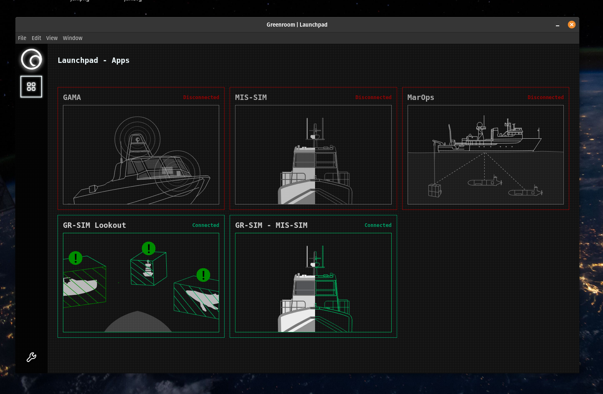

# Greenroom Launchpad

A unified desktop application launcher for Greenroom Robotics software products.

## Greenroom Products

Launchpad provides unified access to the complete Greenroom Robotics software suite:

### GAMA - Maritime Autonomy

A rapidly deployable, system agnostic turnkey solution to marine autonomy, remote operations, and enhanced crews - for vessels up to 100m.

### Lookout+ - AI powered Optical Radar

Vision based AI for detecting marine features, hazards, vessels, and items of interest, to help you navigate the waters safely in any crewing configuration.

### MarOps - Maritime Operations System

Our Maritime Operations System to digitize your operational planning, logging and analysis.

### MIS-SIM - Mission Simulator

A mission simulation environment that bridges between real and synthetic worlds for mission rehearsal, monitoring, and playback.
