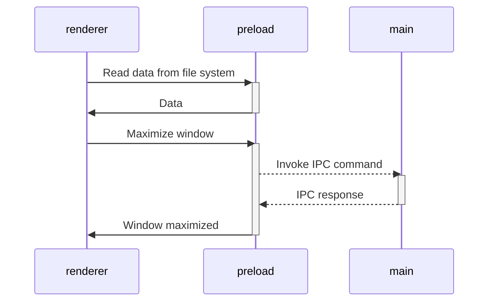

# Greenroom Launchpad

A unified desktop application launcher for Greenroom Robotics software products. Built with Electron, Vite, and TypeScript following security best practices.

## Greenroom Products

Launchpad provides unified access to the complete Greenroom Robotics software suite:

### GAMA - Maritime Autonomy
A rapidly deployable, system agnostic turnkey solution to marine autonomy, remote operations, and enhanced crews - for vessels up to 100m.

### Lookout+ - AI powered Optical Radar
Vision based AI for detecting marine features, hazards, vessels, and items of interest, to help you navigate the waters safely in any crewing configuration.

### MarOps - Maritime Operations System
Our Maritime Operations System to digitize your operational planning, logging and analysis.

### MIS-SIM - Mission Simulator
A mission simulation environment that bridges between real and synthetic worlds for mission rehearsal, monitoring, and playback.

## Get Started

1. Clone this repository
2. Install dependencies: `npm install`
3. Start development mode: `npm start`
4. Build for production: `npm run compile`

## Architecture

Launchpad is built using modern web technologies with security-first principles:

- **Electron**: Secure desktop application framework with latest security patches
- **Vite**: Fast build tool and development server
- **TypeScript**: Type safety throughout the codebase
- **Modular Design**: Monorepo architecture with independent packages

### Security

- Built following Electron security [best practices](https://www.electronjs.org/docs/tutorial/security)
- Context isolation and secure preload scripts
- No Node.js APIs exposed to renderer processes
- Code signing support for distribution

## Project Structure

The project is designed as monorepo where each part of the application is an independent package.
Each package could have own tech stack, tests, dependencies, frameworks, etc.
All internal names are prefixed by `@app/*`.
There are no technical reasons for this.
It's just for you to make it easier to understand the architecture.

Initially, the repository contains only a few packages.

### Packages with building tools:

- [`packages/integrate-renderer`](packages/integrate-renderer) - A helper package that is not included in the runtime.
  It is used in `npm run init` to configure a new interface package.
- [`packages/electron-versions`](packages/electron-versions) - A set of helper functions to get the versions of internal components bundled within Electron.

### Packages with app logic:

- [`packages/main`](packages/main) - Implementation of Electron's [**main script**](https://www.electronjs.org/docs/tutorial/quick-start#create-the-main-script-file).
- [`packages/preload`](packages/preload) - Implementation of Electron's [**preload scripts**](https://www.electronjs.org/docs/latest/tutorial/tutorial-preload).

### Renderer Package

The [`packages/renderer`](packages/renderer) package contains the React-based user interface for the Launchpad application. It provides the main interface for launching and managing Greenroom products.

- Built with React and TypeScript
- Styled with modern CSS
- Integrated with the main Electron process via secure preload scripts

## Distribution

### Building Executables

Launchpad uses [electron-builder] to create distributable applications:

- **Development builds**: `npm run compile` - Creates local executable without auto-update
- **Production builds**: Automated via GitHub Actions for official releases
- **Debug builds**: `npm run compile -- --dir -c.asar=false` - Unpackaged for debugging

Built applications support auto-updates when distributed through official channels.


### Working with third-party dependencies

Because the `renderer` works and builds like a _regular web application_, you can only use dependencies that support the
browser or compile to a browser-friendly format.

This means that in the `renderer` you are free to use any frontend dependencies such as Vue, React, lodash, axios and so
on. However, you _CANNOT_ use any native Node.js APIs, such as, `systeminformation`. These APIs are _only_ available in
a Node.js runtime environment and will cause your application to crash if used in the `renderer` layer. Instead, if you
need access to Node.js runtime APIs in your frontend, export a function form the `preload` package.

All dependencies that require Node.js api can be used in
the [`preload` script](https://www.electronjs.org/docs/latest/tutorial/process-model#preload-scripts).

#### Expose in the main world

Here is an example. Let's say you need to read some data from the file system or database in the renderer.

In the preload context, create a function that reads and returns data. To make the function announced in the preload
available in the render, you usually need to call
the [`electron.contextBridge.exposeInMainWorld`](https://www.electronjs.org/ru/docs/latest/api/context-bridge).

However, this template is designed to use all power of ES modules.
You can import anything from `preload` in `renderer`.
All the data will quietly throw through the `electron.contextBridge.exposeInMainWorld()`,
so you don't need to worry about it.

```ts
// preload/src/index.ts
import {readFile} from 'node:fs/promises';

// Encapsulate types if you use typescript
interface UserData {
  prop: string
}

// Will call `electron.contextBridge.exposeInMainWorld('getUserData', getUserData)`
export function getUserData(): Promise<UserData> {
  return readFile('/path/to/file/in/user/filesystem.json', {encoding: 'utf8'}).then(JSON.parse);
}
```

Now you can import and call the method in renderer

```ts
// renderer/src/anywhere/component.ts
import {getUserData} from '@app/preload'

// Method will came from exposed context
// const userData = globalThis['getUserData']
const userData = await getUserData()
```

> [!TIP]
> Find more
> in [Context Isolation tutorial](https://www.electronjs.org/docs/tutorial/context-isolation#security-considerations).

### Working with Electron API

Although the preload has access to all of Node.js API, it **still runs in the BrowserWindow context**, so only limited
electron modules are available in it.

> [!TIP]
> Check the [electron docs](https://www.electronjs.org/ru/docs/latest/api/clipboard) for the full list of available
> methods.

All other electron methods can be invoked in the `main`.

As a result, the architecture of interaction between all modules is as follows:



> [!TIP]
> Find more in [Inter-Process Communication tutorial](https://www.electronjs.org/docs/latest/tutorial/ipc).

### Modes and Environment Variables

All environment variables are set as part of the `import.meta`, so you can access them vie the following
way: `import.meta.env`.

> [!NOTE]
> If you are using TypeScript and want to get code completion,
> you must add all the environment variables to the [`ImportMetaEnv` in `types/env.d.ts`](types/env.d.ts).

The mode option is used to specify the value of `import.meta.env.MODE` and the corresponding environment variables files
that need to be loaded.

By default, there are two modes:

- `production` is used by default
- `development` is used by `npm start` script

When running the build script, the environment variables are loaded from the following files in your project root:

```
.env                # loaded in all cases
.env.local          # loaded in all cases, ignored by git
.env.[mode]         # only loaded in specified env mode
.env.[mode].local   # only loaded in specified env mode, ignored by git
```

> [!WARNING]
> To prevent accidentally leaking env variables to the client, only variables prefixed with `VITE_` are exposed to your
> Vite-processed code.

For example, let's take the following `.env` file:

```
DB_PASSWORD=foobar
VITE_SOME_KEY=123
```

Only `VITE_SOME_KEY` will be exposed as `import.meta.env.VITE_SOME_KEY` to your client source code, but `DB_PASSWORD`
will not.

> [!TIP]
> You can change that prefix or add another. See [`envPrefix`](https://vitejs.dev/config/shared-options.html#envprefix).

### NPM Scripts

```sh
npm start
```
Start application in development more with hot-reload.

---
```sh
npm run build
```
Runs the `build` command in all workspaces if present.

---
```sh
npm run compile
```
First runs the `build` script,
then compiles the project into executable using `electron-builder` with the specified configuration.

---
```sh
npm run compile -- --dir -c.asar=false
```
Same as `npm run compile` but passes additional parameters to disable archive packaging and installer creation.
Useful for debugging the compiled application.

---
```sh
npm run test
```
Executes end-to-end tests on **compiled app** using Playwright.

---
```sh
npm run typecheck
```
Runs the `typecheck` command in all workspaces if present.

---
```sh
npm run create-renderer
```
Initializes a new Vite project named `renderer`. Basically same as `npm create vite`.

---
```sh
npm run integrate-renderer
```
Starts the integration process of the renderer using the Vite Electron builder.

---
```sh
npm run init
```
Set up the initial environment by creating a new renderer, integrating it, and installing the necessary packages.

## Development

This project uses a monorepo structure with independent packages. Each package can have its own dependencies, tests, and build processes. See the individual package README files for specific development instructions.


[vite]: https://github.com/vitejs/vite/

[electron]: https://github.com/electron/electron

[electron-builder]: https://github.com/electron-userland/electron-builder

[playwright]: https://playwright.dev
